# Master Implementation Plan: Healthcare Ambient Clinical Scribe & Automated SOAP Note Generator

## 1. Executive Summary
This document provides a realistic, execution-ready, senior-level 4-week engineering blueprint for building an **Ambient Clinical AI Scribe & Automated SOAP Note Generator**. Designed for a single GenAI Engineering Intern over a 4-week sprint, this plan converts unstructured doctor-patient clinical dialogue into a structured **SOAP Note (Subjective, Objective, Assessment, Plan)**, suggests relevant **ICD-10 billing codes** via Retrieval-Augmented Generation (RAG), and provides a **Human-in-the-Loop (HITL) Review Dashboard** for final physician approval and export.

The core Generative AI stack leverages **Whisper API** for Automatic Speech Recognition (ASR) and **Mistral API** as the primary LLM provider for clinical SOAP note synthesis. Mistral is selected because it provides an accessible free/low-cost option suitable for this project.

The planning philosophy prioritizes **end-to-end workflow reliability, progressive weekly integration, robust continuous testing, and explicit MLOps standards** over visual bloat or speculative over-engineering.

---

## 2. Project Objectives
1. **Clinical Workflow Automation**: Reduce documentation overhead by transcribing clinical consultations and extracting structured clinical entities automatically.
2. **Audio-to-SOAP Pipeline**: Ingest multi-speaker audio, apply Automatic Speech Recognition (ASR) via Whisper, perform 2-speaker diarization (`SPEAKER_00`, `SPEAKER_01`), and map dialogue into validated JSON SOAP notes using Mistral LLM structured outputs.
3. **ICD-10 Coding Assistance**: Provide ranked ICD-10 code recommendations based on the generated "Assessment" section using a lightweight vector database (ChromaDB).
4. **Physician Supervision & Control**: Enforce mandatory Human-in-the-Loop approval, allowing physicians to review, edit, search/modify ICD-10 codes, and finalize exportable notes.
5. **MLOps & Quality Assurance**: Maintain continuous daily GitHub activity across 4 weekly milestones with automated unit/integration testing and explicit evaluation scripts (WER, SOAP validity, RAG Precision@K).

---

## 3. MVP Scope & Priority Classification

### P0 — Must Have (Mandatory Core MVP)
- **Security & Config**: Environment-based config (`.env`), secrets protection (`.gitignore`), zero hardcoded keys, synthetic-only data policy.
- **Backend Infrastructure**: Python FastAPI backend with structured error handling, CORS, and endpoint schema validation.
- **Audio Processing & ASR**: Multi-format audio upload (WAV/MP3/M4A), 16kHz mono normalization, OpenAI Whisper ASR integration.
- **Speaker Diarization**: Basic 2-speaker timestamp-based segment classification (`SPEAKER_00`, `SPEAKER_01`) without mandatory role assignment.
- **SOAP Synthesis (Mistral LLM)**: Mistral API (`mistral-small-latest` or `mistral-large-latest`) integration with system prompts, JSON format enforcement (`response_format={"type": "json_object"}`), Pydantic validation, and auto-retry fallback.
- **Anti-Hallucination Safeguards**: Prompts & validation rules to prevent synthetic vitals/symptoms not present in dialogue.
- **ICD-10 RAG Engine**: ICD-10 CSV dataset loader, ChromaDB vector store indexing, similarity retrieval for SOAP Assessment.
- **Human-in-the-Loop Frontend**: Clean React/Vite web UI displaying:
  - Audio Recorder / File Drag-and-Drop Uploader
  - Speaker-Diarized Transcript Viewer (`SPEAKER_00`, `SPEAKER_01`)
  - Editable 4-card SOAP Note Editor (Subjective, Objective, Assessment, Plan)
  - Interactive ICD-10 Selection & Recommendation Panel
  - Note Finalization & JSON Export Action
- **Testing & Continuous MLOps**: Unit and integration test suite (`pytest`), 4 weekly GitHub Pull Requests, technical README.

### P1 — Important Enhancements (High-Value Polish)
- **Retries & Error Handling**: Exponential backoff for external Mistral LLM and Whisper ASR API timeouts.
- **Evaluation Pipelines**: Automated scripts for:
  - **ASR**: Word Error Rate (WER) script against benchmark audio.
  - **SOAP**: Schema compliance and fact-preservation benchmark on Mistral outputs.
  - **RAG**: Retrieval Precision@5 and MRR scoring script.
- **Manual ICD-10 Search**: Keyword lookup API & UI component for codes not returned by RAG top-K.
- **Exporting Options**: Client-side Markdown / formatted text printable export.
- **Basic Security**: Utility for PHI sanitization / logger masking.

### P2 — Stretch Goals (Optional / Low Priority)
- **Speaker Role Classification**: Mistral heuristic to map `SPEAKER_00`/`SPEAKER_01` $\rightarrow$ `Doctor`/`Patient`.
- **Local Whisper Fallback**: `whisper.cpp` or local `faster-whisper` fallback when ASR API key is unconfigured.
- **Export Formats**: FHIR JSON resource generation or PDF document rendering.
- **UX Polish**: Dark mode toggle, glassmorphism CSS effects, micro-animations.

---

## 4. Final System Architecture

```mermaid
graph TD
    subgraph Client ["Frontend (React + Vite)"]
        App["App.jsx (Layout & State Host)"]
        AudioComp["AudioRecorder.jsx"]
        TransComp["TranscriptViewer.jsx"]
        SoapComp["SoapNoteEditor.jsx"]
        IcdComp["Icd10Selector.jsx"]
        ExportComp["EhrExportModal.jsx"]
        ApiClient["api/client.js"]
    end

    subgraph API ["Backend API (FastAPI)"]
        Main["main.py"]
        Config["config.py"]
        Schemas["models/schemas.py"]
        
        subgraph Endpoints ["REST Routers"]
            R_Audio["routers/audio_router.py"]
            R_Soap["routers/soap_router.py"]
            R_Icd["routers/icd10_router.py"]
            R_Ehr["routers/ehr_router.py"]
        end

        subgraph CoreServices ["Core Business Logic"]
            S_AudioIngest["services/audio_ingestion.py"]
            S_Asr["services/asr_service.py (Whisper)"]
            S_Diar["services/diarization_service.py"]
            S_SoapPrompts["services/prompt_templates.py"]
            S_SoapSynth["services/soap_synthesizer.py (Mistral API)"]
            S_IcdLoader["services/icd10_loader.py"]
            S_VecStore["services/vector_store.py"]
            S_IcdRag["services/icd10_rag_service.py"]
            S_Export["services/ehr_export.py"]
            U_Sec["utils/security.py"]
        end
    end

    %% Component to API Client
    AudioComp --> ApiClient
    TransComp --> ApiClient
    SoapComp --> ApiClient
    IcdComp --> ApiClient
    ExportComp --> ApiClient

    %% Client to Routers
    ApiClient -->|POST /api/audio/transcribe| R_Audio
    ApiClient -->|POST /api/soap/generate| R_Soap
    ApiClient -->|POST /api/soap/recommend-icd10| R_Icd
    ApiClient -->|GET /api/icd10/search| R_Icd
    ApiClient -->|POST /api/soap/finalize| R_Ehr

    %% Main & Router Dispatch
    Main --> R_Audio
    Main --> R_Soap
    Main --> R_Icd
    Main --> R_Ehr

    %% Router to Services
    R_Audio --> S_AudioIngest
    R_Audio --> S_Asr
    R_Audio --> S_Diar

    R_Soap --> S_SoapPrompts
    R_Soap --> S_SoapSynth

    R_Icd --> S_IcdRag
    S_IcdRag --> S_VecStore
    S_VecStore --> S_IcdLoader

    R_Ehr --> S_Export
    R_Ehr --> U_Sec
```



---

## 5. Project Directory Structure

```text
Healthcare SOAP/
├── .env.example
├── .gitignore
├── README.md
├── requirements.txt
├── pytest.ini
├── backend/
│   └── app/
│       ├── __init__.py
│       ├── main.py
│       ├── config.py
│       ├── models/
│       │   ├── __init__.py
│       │   └── schemas.py
│       ├── routers/
│       │   ├── __init__.py
│       │   ├── audio_router.py
│       │   ├── soap_router.py
│       │   ├── icd10_router.py
│       │   └── ehr_router.py
│       ├── services/
│       │   ├── __init__.py
│       │   ├── audio_ingestion.py
│       │   ├── asr_service.py
│       │   ├── diarization_service.py
│       │   ├── prompt_templates.py
│       │   ├── soap_synthesizer.py
│       │   ├── icd10_loader.py
│       │   ├── vector_store.py
│       │   ├── icd10_rag_service.py
│       │   └── ehr_export.py
│       └── utils/
│           ├── __init__.py
│           └── security.py
├── frontend/
│   ├── package.json
│   ├── vite.config.js
│   ├── index.html
│   └── src/
│       ├── App.jsx
│       ├── main.jsx
│       ├── api/
│       │   └── client.js
│       ├── components/
│       │   ├── AudioRecorder.jsx
│       │   ├── TranscriptViewer.jsx
│       │   ├── SoapNoteEditor.jsx
│       │   ├── Icd10Selector.jsx
│       │   └── EhrExportModal.jsx
│       └── styles/
│           └── main.css
├── data/
│   ├── icd10_codes.csv
│   ├── sample_audio/
│   └── sample_transcripts/
├── scripts/
│   ├── eval_wer.py
│   ├── eval_soap_quality.py
│   └── eval_rag.py
└── tests/
    ├── test_audio_pipeline.py
    ├── test_soap_synthesis.py
    ├── test_icd10_rag.py
    └── test_e2e_workflow.py
```

---

## 6. File Responsibility Matrix

To maintain clean modularity, each component adheres to single primary responsibilities and clear interfaces:

| File Path | Primary Module Responsibility | Inputs | Outputs | Primary Interconnections |
|---|---|---|---|---|
| `backend/app/config.py` | Environment & settings configuration loader (loads `MISTRAL_API_KEY`, `OPENAI_API_KEY`). | `.env` variables | Config dataclass/object | `main.py`, services |
| `backend/app/models/schemas.py` | Pydantic data contract validation models. | Raw dict payloads | Validated Pydantic objects | Routers, `soap_synthesizer.py` |
| `backend/app/utils/security.py` | Logger PHI sanitization & security helpers. | Raw text / headers | Sanitized text / status | Routers, logger wrappers |
| `backend/app/services/audio_ingestion.py` | Audio format validation & WAV conversion. | Raw audio file | Standardized WAV byte stream | `audio_router.py` |
| `backend/app/services/asr_service.py` | Speech-to-text transcription via Whisper API. | WAV file | Raw transcript + segment timestamps | `audio_router.py` |
| `backend/app/services/diarization_service.py` | 2-speaker segment classification (`SPEAKER_00`/`01`). | Utterance timestamps | Diarized utterance list | `audio_router.py` |
| `backend/app/routers/audio_router.py` | Endpoint `/api/audio/transcribe`. | Multipart HTTP file upload | `DiarizedTranscriptResponse` | Audio ingestion, ASR, Diarization services |
| `backend/app/services/prompt_templates.py` | System prompts & few-shot clinical examples for Mistral. | Context parameters | Formatted prompt strings | `soap_synthesizer.py` |
| `backend/app/services/soap_synthesizer.py` | Mistral API call (`mistralai` SDK), JSON parsing & Pydantic validation retry. | Diarized transcript | Structured `SOAPNote` schema | `soap_router.py` |
| `backend/app/routers/soap_router.py` | Endpoint `/api/soap/generate`. | `TranscriptPayload` | Structured SOAP JSON | `soap_synthesizer.py` |
| `backend/app/services/icd10_loader.py` | ICD-10 CSV parsing and pre-processing. | `icd10_codes.csv` | Code-Description list | `vector_store.py` |
| `backend/app/services/vector_store.py` | ChromaDB collection initialization & indexing. | Structured ICD-10 list | ChromaDB Vector Store instance | `icd10_rag_service.py` |
| `backend/app/services/icd10_rag_service.py` | Similarity retrieval & score ranking for Assessment. | SOAP Assessment text | Ranked candidate ICD-10 list | `icd10_router.py` |
| `backend/app/routers/icd10_router.py` | Endpoints `/api/soap/recommend-icd10`, `/search`. | Assessment text / Query | Ranked ICD-10 recommendation array | `icd10_rag_service.py` |
| `backend/app/services/ehr_export.py` | Final approved session packaging (JSON / text export). | SOAP note + ICD choices | Export payload / File download stream | `ehr_router.py` |
| `backend/app/routers/ehr_router.py` | Endpoint `/api/soap/finalize`. | Final HITL Session state | Finalized session metadata | `ehr_export.py` |
| `backend/app/main.py` | FastAPI application initialization & router wiring. | HTTP requests | API Router dispatch | All router modules |
| `frontend/src/api/client.js` | Axios/Fetch wrapper for backend REST calls. | UI component calls | Promise with API JSON data | All React components |
| `frontend/src/components/AudioRecorder.jsx` | Audio recording & file dropzone widget. | User interaction / mic input | Form upload payload | `App.jsx`, `client.js` |
| `frontend/src/components/TranscriptViewer.jsx` | Speaker-tagged conversation transcript viewer (`SPEAKER_00`/`01`). | Diarized transcript payload | Rendered speaker bubbles | `App.jsx` |
| `frontend/src/components/SoapNoteEditor.jsx` | Interactive 4-section editable clinical note editor. | SOAP note JSON | Edited SOAP note state | `App.jsx` |
| `frontend/src/components/Icd10Selector.jsx` | Recommended ICD-10 code manager & search UI. | Recommended & searched codes | Selected ICD-10 code array | `App.jsx`, `client.js` |
| `frontend/src/components/EhrExportModal.jsx` | Final human review sign-off & export trigger. | Full session state | Finalized payload trigger | `App.jsx`, `client.js` |
| `frontend/src/App.jsx` | Main state orchestrator & application layout shell. | User workflow | Integrated UI view | All frontend components |

---

## 7. Critical Dependency Chain

```text
[1. Security & Config Setup (.env, config.py, MISTRAL_API_KEY)]
                     ↓
[2. Audio Ingestion & Format Normalization (audio_ingestion.py)]
                     ↓
[3. Speech-to-Text Transcription via Whisper (asr_service.py)]
                     ↓
[4. Speaker Diarization - SPEAKER_00/01 (diarization_service.py)]
                     ↓
[5. Diarized Transcript Schema & API Router (audio_router.py)]  ===>  (End of Week 1 Integration Milestone)
                     ↓
[6. Clinical SOAP Pydantic Schema (schemas.py)]
                     ↓
[7. Mistral Prompts & Synthesis with JSON Validation Retry (soap_synthesizer.py)]
                     ↓
[8. SOAP Generation API Router (soap_router.py)]               ===>  (End of Week 2 Integration Milestone)
                     ↓
[9. ICD-10 Dataset Ingestion & ChromaDB Vector Store (vector_store.py)]
                     ↓
[10. ICD-10 Query Normalization & RAG Engine (icd10_rag_service.py)]
                     ↓
[11. ICD-10 Recommendation & Search API Router (icd10_router.py)] ===>  (End of Week 3 Integration Milestone)
                     ↓
[12. Human-in-the-Loop React UI Components (Audio, Transcript, SOAP, ICD-10)]
                     ↓
[13. Session Finalization & Export Endpoint (ehr_router.py)]     ===>  (End of Week 4 Final E2E Milestone)
```

---

## 8. API Contract Overview

### 1. Audio Upload & Transcription
- **HTTP Method**: `POST`
- **Endpoint**: `/api/audio/transcribe`
- **Request**: `multipart/form-data` containing `file: UploadFile` (WAV, MP3, M4A).
- **Response Schema (`200 OK`)**:
  ```json
  {
    "session_id": "string (uuid)",
    "audio_duration_seconds": 142.5,
    "raw_transcript": "string",
    "utterances": [
      {
        "speaker_id": "SPEAKER_00",
        "start_time": 0.0,
        "end_time": 4.2,
        "text": "Hello Mr. Smith, what brings you in today?"
      },
      {
        "speaker_id": "SPEAKER_01",
        "start_time": 4.5,
        "end_time": 8.1,
        "text": "I've had a persistent cough and fever for three days."
      }
    ]
  }
  ```
- **Error Responses**: `400 Bad Request` (Invalid format), `502 Bad Gateway` (ASR API failure).

### 2. SOAP Note Generation
- **HTTP Method**: `POST`
- **Endpoint**: `/api/soap/generate`
- **Request Schema**:
  ```json
  {
    "session_id": "string (uuid)",
    "utterances": [
      {
        "speaker_id": "SPEAKER_00",
        "text": "Hello Mr. Smith, what brings you in today?"
      },
      {
        "speaker_id": "SPEAKER_01",
        "text": "I've had a persistent cough and fever for three days."
      }
    ]
  }
  ```
- **Response Schema (`200 OK`)**:
  ```json
  {
    "session_id": "string (uuid)",
    "soap_note": {
      "subjective": {
        "chief_complaint": "Persistent cough and mild fever for 3 days.",
        "history_of_present_illness": "Patient reports dry cough starting Tuesday...",
        "review_of_systems": ["Fever", "Cough", "Denies shortness of breath"]
      },
      "objective": {
        "vital_signs": {"temperature": "100.4 F", "blood_pressure": "120/80"},
        "physical_exam": "Oropharynx mildly erythematous, lungs clear to auscultation."
      },
      "assessment": {
        "primary_diagnosis": "Acute Upper Respiratory Infection",
        "differential_diagnoses": ["Acute Bronchitis", "Influenza"],
        "clinical_summary": "34yo male presenting with acute upper respiratory symptoms..."
      },
      "plan": {
        "medications": ["Acetaminophen 500mg as needed"],
        "diagnostic_tests": ["Rapid Influenza Diagnostic Test"],
        "patient_education": "Rest, hydration, return if dyspnea develops.",
        "follow_up": "1 week if symptoms persist."
      }
    }
  }
  ```
- **Error Responses**: `422 Unprocessable Entity` (Mistral LLM Schema parse error), `504 Gateway Timeout`.

### 3. ICD-10 Recommendation
- **HTTP Method**: `POST`
- **Endpoint**: `/api/soap/recommend-icd10`
- **Request Schema**:
  ```json
  {
    "assessment_text": "Acute Upper Respiratory Infection. Differential: Acute Bronchitis.",
    "top_k": 5
  }
  ```
- **Response Schema (`200 OK`)**:
  ```json
  {
    "query_text": "Acute Upper Respiratory Infection...",
    "recommendations": [
      {
        "code": "J06.9",
        "description": "Acute upper respiratory infection, unspecified",
        "retrieval_relevance_score": 0.89,
        "category": "Diseases of the respiratory system"
      }
    ]
  }
  ```

### 4. Manual ICD-10 Search
- **HTTP Method**: `GET`
- **Endpoint**: `/api/icd10/search?q=bronchitis&limit=10`
- **Response Schema (`200 OK`)**:
  ```json
  {
    "query": "bronchitis",
    "results": [
      {
        "code": "J20.9",
        "description": "Acute bronchitis, unspecified",
        "category": "Diseases of the respiratory system"
      }
    ]
  }
  ```

### 5. Finalize Session & Export
- **HTTP Method**: `POST`
- **Endpoint**: `/api/soap/finalize`
- **Request Schema**:
  ```json
  {
    "session_id": "string (uuid)",
    "final_soap_note": { /* Full user-edited SOAP object */ },
    "selected_icd10_codes": [
      {"code": "J06.9", "description": "Acute upper respiratory infection, unspecified"}
    ],
    "physician_notes": "Reviewed and approved during consultation."
  }
  ```
- **Response Schema (`200 OK`)**:
  ```json
  {
    "status": "success",
    "finalized_at": "2026-08-24T14:30:00Z",
    "session_id": "string (uuid)",
    "summary_export": "Formatted text block / download URL"
  }
  ```

---

## 9. Four-Week Roadmap

### Week 1 — Foundation, Security & Audio Pipeline
**Goal**: Build a secure FastAPI foundation and process audio files into structured 2-speaker diarized transcripts (`SPEAKER_00`, `SPEAKER_01`).

#### Week 1 Task Matrix
| Task ID | Task Description | Dependency | Priority | Est. Effort | Target File | Risk & Mitigation |
|---|---|---|---|---|---|---|
| W1.1 | Project scaffold, `.env.example`, `.gitignore`, `config.py` setup (loading `MISTRAL_API_KEY`). | None | P0 | 0.5 Day | `config.py`, `.env.example` | Risk: Secret leak. Mitigate: Add `.env` to `.gitignore` immediately. |
| W1.2 | FastAPI app setup with CORS, logging middleware, error handlers. | W1.1 | P0 | 0.5 Day | `main.py`, `security.py` | Risk: Middleware CORS block. Mitigate: Allow explicit local UI origin. |
| W1.3 | Audio ingestion service: validate format, convert to 16kHz mono WAV. | W1.2 | P0 | 1.0 Day | `audio_ingestion.py` | Risk: Missing `ffmpeg`. Mitigate: Document `ffmpeg` dependency & add fallback check. |
| W1.4 | ASR integration with Whisper API + error handling/retry. | W1.3 | P0 | 1.0 Day | `asr_service.py` | Risk: ASR API rate limit / timeout. Mitigate: Wrap call in retry decorator. |
| W1.5 | Speaker diarization service (basic 2-speaker `SPEAKER_00`/`01` timestamp split). | W1.4 | P0 | 1.0 Day | `diarization_service.py` | Risk: Poor speaker split. Mitigate: Keep to basic `SPEAKER_00`/`01` segmentation. |
| W1.6 | Audio router endpoint `/api/audio/transcribe` wiring all services. | W1.5 | P0 | 0.5 Day | `audio_router.py` | Risk: Payload schema mismatch. Mitigate: Validate with Pydantic. |
| W1.7 | Unit & Integration testing + Week 1 PR submission. | W1.6 | P0 | 0.5 Day | `tests/test_audio_pipeline.py` | Risk: Test audio missing. Mitigate: Include synthetic WAV sample in `data/`. |

---

### Week 2 — Clinical SOAP Intelligence via Mistral API
**Goal**: Convert diarized transcripts into strictly structured, clinically valid JSON SOAP notes using Mistral LLM with Pydantic validation and retry mechanisms.

#### Week 2 Task Matrix
| Task ID | Task Description | Dependency | Priority | Est. Effort | Target File | Risk & Mitigation |
|---|---|---|---|---|---|---|
| W2.1 | Define complete Pydantic schemas for Subjective, Objective, Assessment, Plan. | W1.6 | P0 | 0.5 Day | `schemas.py` | Risk: Overly nested schema. Mitigate: Keep fields clean and explicit. |
| W2.2 | Create clinical prompt engine tailored for Mistral (`mistral-small-latest`). | W2.1 | P0 | 1.0 Day | `prompt_templates.py` | Risk: Mistral includes conversational filler. Mitigate: Strict system prompt + JSON instructions. |
| W2.3 | LLM SOAP synthesis service using `mistralai` SDK with JSON response format & Pydantic validation retry. | W2.2 | P0 | 1.5 Days | `soap_synthesizer.py` | Risk: JSON parsing failure. Mitigate: Catch JSONDecodeError/ValidationError and retry with error feedback prompt. |
| W2.4 | Implement Anti-Hallucination guards & empty field fallbacks. | W2.3 | P0 | 0.5 Day | `soap_synthesizer.py` | Risk: Invented vitals. Mitigate: Prompt explicitly: "Extract ONLY stated facts; mark missing as Not Stated". |
| W2.5 | Create SOAP Router endpoint `/api/soap/generate`. | W2.3 | P0 | 0.5 Day | `soap_router.py` | Risk: Long LLM response latency. Mitigate: Set 30s timeout & user loading state. |
| W2.6 | Create synthetic benchmark dataset & evaluation script (`eval_soap_quality.py`). | W2.5 | P1 | 0.5 Day | `scripts/eval_soap_quality.py` | Risk: Manual testing slow. Mitigate: Automated script running 5 sample transcripts against Mistral. |
| W2.7 | Unit & Integration testing + Week 2 PR submission. | W2.5 | P0 | 0.5 Day | `tests/test_soap_synthesis.py` | Risk: Flaky LLM test results. Mitigate: Use deterministic mock response for unit tests. |

---

### Week 3 — ICD-10 RAG Engine & Backend Integration
**Goal**: Build a vector-backed ICD-10 recommendation engine and complete backend system integration.

#### Week 3 Task Matrix
| Task ID | Task Description | Dependency | Priority | Est. Effort | Target File | Risk & Mitigation |
|---|---|---|---|---|---|---|
| W3.1 | Clean and format ICD-10 medical code dictionary dataset (`icd10_codes.csv`). | None | P0 | 0.5 Day | `icd10_loader.py` | Risk: Huge dataset slowing vector store. Mitigate: Filter to top 2,000 common codes for MVP. |
| W3.2 | Initialize ChromaDB vector store and index ICD-10 embeddings. | W3.1 | P0 | 1.0 Day | `vector_store.py` | Risk: Embedding generation slow. Mitigate: Persist ChromaDB index to disk in `data/chroma_db`. |
| W3.3 | Implement ICD-10 RAG service: Assessment query normalization & similarity search. | W3.2 | P0 | 1.0 Day | `icd10_rag_service.py` | Risk: Irrelevant codes retrieved. Mitigate: Pre-clean query string & return top-5 with relevance scores. |
| W3.4 | Build ICD-10 router endpoints `/api/soap/recommend-icd10` & `/api/icd10/search`. | W3.3 | P0 | 0.5 Day | `icd10_router.py` | Risk: Missing code search. Mitigate: Implement fallback substring search endpoint. |
| W3.5 | Build RAG evaluation script (`eval_rag.py`) measuring Precision@5 and MRR. | W3.3 | P1 | 0.5 Day | `scripts/eval_rag.py` | Risk: Unverified retrieval accuracy. Mitigate: Run eval script against 10 gold-standard diagnostic pairs. |
| W3.6 | Implement basic PHI redaction utility in logger & security helpers. | W1.2 | P1 | 0.5 Day | `security.py` | Risk: PHI in server logs. Mitigate: Regex mask names/dates in log streams. |
| W3.7 | Integration testing + Week 3 PR submission. | W3.4 | P0 | 0.5 Day | `tests/test_icd10_rag.py` | Risk: Database locking in tests. Mitigate: Use isolated temporary Chroma collection for testing. |

---

### Week 4 — HITL Dashboard, Progressive Integration & Final Polish
**Goal**: Deliver a clean React web interface connecting the entire workflow end-to-end with human-in-the-loop review, finalization, export, and thorough testing.

#### Week 4 Task Matrix
| Task ID | Task Description | Dependency | Priority | Est. Effort | Target File | Risk & Mitigation |
|---|---|---|---|---|---|---|
| W4.1 | React/Vite frontend scaffold, API client setup (`client.js`), base layout (`App.jsx`). | W1-W3 | P0 | 0.5 Day | `App.jsx`, `client.js` | Risk: CORS error. Mitigate: Verify FastAPI backend CORS headers. |
| W4.2 | Build Audio Recorder & Upload Dropzone component. | W4.1 | P0 | 0.5 Day | `AudioRecorder.jsx` | Risk: Mic browser permissions. Mitigate: Support file drag-and-drop fallback. |
| W4.3 | Build Speaker-Diarized Transcript Viewer component (`SPEAKER_00`, `SPEAKER_01`). | W4.2 | P0 | 0.5 Day | `TranscriptViewer.jsx` | Risk: Large text overflow. Mitigate: Wrap transcript in scrollable container with speaker badges. |
| W4.4 | Build Interactive 4-Card Editable SOAP Note Editor. | W4.1 | P0 | 1.0 Day | `SoapNoteEditor.jsx` | Risk: Unsaved edits lost. Mitigate: Maintain component state synchronized with App state. |
| W4.5 | Build ICD-10 Recommendation & Selection Panel component. | W4.1 | P0 | 0.5 Day | `Icd10Selector.jsx` | Risk: User cannot find code. Mitigate: Include manual search input box in panel. |
| W4.6 | Build Human Review Sign-Off & EHR Finalize Modal + backend endpoint. | W4.4, W4.5 | P0 | 0.5 Day | `EhrExportModal.jsx`, `ehr_router.py` | Risk: Export payload incomplete. Mitigate: Validate required sign-off fields before payload submit. |
| W4.7 | Complete End-to-End Automated & Manual System Verification. | All | P0 | 1.0 Day | `tests/test_e2e_workflow.py` | Risk: Integration breakdown. Mitigate: Progressive verification of full Audio->Export pipeline. |
| W4.8 | Final Documentation, README update, and project release packaging. | All | P0 | 0.5 Day | `README.md` | Risk: Missing setup instructions. Mitigate: Test clean clone execution steps. |

---

## 10. Testing Strategy

1. **Unit Tests (`pytest tests/`)**:
   - `test_schemas.py`: Schema constraints & field checks.
   - `test_audio_ingestion.py`: Audio formatting & duration logic.
   - `test_prompt_templates.py`: Prompt variable formatting for Mistral.
2. **Integration Tests**:
   - `test_audio_pipeline.py`: Upload -> ASR -> 2-speaker diarization output.
   - `test_soap_synthesis.py`: Transcript input -> Mistral API call -> Pydantic SOAP JSON validation.
   - `test_icd10_rag.py`: Assessment text -> ChromaDB vector retrieval -> Candidate ranking output.
3. **End-to-End Workflow Test (`test_e2e_workflow.py`)**:
   - Full simulated flow: Audio upload -> Diarized transcript -> Mistral SOAP note generation -> ICD-10 recommendation -> HITL sign-off -> Final JSON export.
4. **Negative & Resilience Tests**:
   - Corrupted audio file rejection, API rate limit retry handling, invalid JSON response retry from LLM.

---

## 11. Evaluation Metrics

1. **ASR Performance (WER)**: `scripts/eval_wer.py` calculates Levenshtein distance on benchmark sample transcripts. Target: WER $\le 12\%$.
2. **SOAP Note Synthesis Quality**: `scripts/eval_soap_quality.py` evaluates Mistral outputs:
   - **Schema Compliance Rate**: $\%$ of LLM outputs passing Pydantic validation (Target: 100%).
   - **Completeness Rate**: $\%$ of required clinical sections populated (Target: $\ge 95\%$).
   - **Hallucination Rate**: Count of unsupported clinical claims evaluated against synthetic ground-truth dialogues (Target: 0 invented vitals).
3. **ICD-10 RAG Retrieval**: `scripts/eval_rag.py` measures Precision@5 ($\ge 70\%$) and MRR ($\ge 0.75$).

---

## 12. Risk Register

| Risk ID | Risk Description | Prob. | Impact | Mitigation Strategy |
|---|---|---|---|---|
| R01 | Speaker role confusion | Med | High | Constrain MVP to basic 2-speaker (`SPEAKER_00`/`01`) timestamp segmentation. Doctor/Patient role labeling is P2. |
| R02 | ASR / LLM API rate limits or network timeouts | Med | Med | Wrap API calls with exponential backoff retry logic. |
| R03 | Mistral LLM formatting errors / JSON parse failures | Med | High | Enforce JSON output format (`response_format={"type": "json_object"}`) + Pydantic validation retry loop. |
| R04 | Poor ICD-10 retrieval relevance from vector store | Med | High | Clean diagnosis query strings before embedding; provide manual keyword search UI as a fallback. |
| R05 | Week 4 UI development scope creep | High | High | Restrict UI strictly to P0 workflow components; downgrade dark mode, glassmorphism, and FHIR to P2. |
| R06 | Accidental API key exposure in GitHub repository | Low | Crit | Enforce `.env` configuration, write `.env.example`, add `.gitignore` on Day 1 before any code commits. |
| R07 | Third-party library version drift / breaking changes | Med | Med | Lock dependency versions strictly in `requirements.txt` and `package.json`. |
| R08 | Integration breakdown at end of project | Med | High | Implement progressive weekly integration milestones (W1 Audio, W2 SOAP, W3 RAG, W4 Full UI). |
| R09 | Developer context loss across multi-week sprint | Low | Med | Maintain clean modular architecture and clear file responsibility boundaries. |

---

## 13. Security & Privacy Plan

1. **Foundational Environment Security**: `.env` configuration, `.env.example` template, `.gitignore` protection for secrets and audio uploads.
2. **Synthetic Data Policy**: 100% synthetic mock patient dialogues; zero real patient PHI.
3. **PHI Redaction Helper (`security.py`)**: Regex sanitization utility for logging safeguards.

---

## 14. GitHub & MLOps Workflow

- **Branch Strategy**: Feature branches (`feature/audio-pipeline`, `feature/soap-synthesis`, etc.) with clean Pull Requests to `main`.
- **Commit Cadence**: 3 to 5 logical commits per active development day with issue references.
- **4 Weekly Pull Requests**:
  - **PR 1**: Audio Ingestion & Diarization Pipeline.
  - **PR 2**: SOAP Pydantic Schemas & Mistral Synthesis.
  - **PR 3**: ICD-10 Vector Index & RAG Engine.
  - **PR 4**: React HITL Dashboard & End-to-End Integration.

---

## 15. Global Definition of Done (DoD)

A milestone is **Done** when code is complete, modularly separated, unit tested (`pytest`), handles edge cases/retries, documented, and merged into `main` via a clean Pull Request.

---

## 16. Final End-to-End Acceptance Criteria

Audio Upload $\rightarrow$ Diarized Transcript (`SPEAKER_00`/`01`) $\rightarrow$ Mistral SOAP Note Generation $\rightarrow$ Top-5 ICD-10 RAG Suggestions $\rightarrow$ Physician Review & Edit $\rightarrow$ Final Sign-off & Export Payload.

---

## 17. Official Requirement Traceability Matrix

| Official Spec Requirement (Gen AI Project.pdf - Project 1) | Planned Implementation Component | Target Week | Priority | Status |
|---|---|---|---|---|
| Audio Ingestion & ASR Pipeline | `audio_ingestion.py`, `asr_service.py` (Whisper API) | Week 1 | P0 | Planned |
| Multi-speaker medical audio transcription | `asr_service.py`, `diarization_service.py` | Week 1 | P0 | Planned |
| Speaker Diarization (2-speaker split) | `diarization_service.py` (`SPEAKER_00`/`01`) | Week 1 | P0 | Planned |
| LLM Synthesis Engine | `soap_synthesizer.py` (**Mistral API**), `prompt_templates.py` | Week 2 | P0 | Planned |
| Few-shot prompt engineering | `prompt_templates.py` (Mistral clinical prompts) | Week 2 | P0 | Planned |
| Structured JSON schema for SOAP note | `models/schemas.py`, Mistral JSON mode + Pydantic validation | Week 2 | P0 | Planned |
| Anti-hallucination & clinical data filtering | `soap_synthesizer.py` (anti-hallucination rules) | Week 2 | P0 | Planned |
| ICD-10 Code Recommendation RAG | `vector_store.py` (ChromaDB), `icd10_rag_service.py` | Week 3 | P0 | Planned |
| ICD-10 Vector Database | `vector_store.py` (ChromaDB index) | Week 3 | P0 | Planned |
| Assessment section cross-referencing | `icd10_rag_service.py` | Week 3 | P0 | Planned |
| React or Streamlit Dashboard | React (Vite) Web UI (`frontend/src/`) | Week 4 | P0 | Planned |
| View Transcript alongside generated SOAP note | `TranscriptViewer.jsx`, `SoapNoteEditor.jsx` | Week 4 | P0 | Planned |
| Human-in-the-Loop validation step | `SoapNoteEditor.jsx`, `Icd10Selector.jsx`, `EhrExportModal.jsx` | Week 4 | P0 | Planned |
| Doctor note editing before finalization | `SoapNoteEditor.jsx` | Week 4 | P0 | Planned |
| Secure GitHub codebase & API key protection | `.env`, `.gitignore`, `config.py`, 4-week PR history | Weeks 1–4 | P0 | Planned |

---

## 18. Stretch Goals (P2 Scope)

1. **Speaker Role Classification**: Use a Mistral heuristic pass over transcript turns to map `SPEAKER_00`/`01` $\rightarrow$ `Doctor`/`Patient`.
2. **Local ASR Fallback**: Integrate `faster-whisper` for offline local transcription when ASR API keys are absent.
3. **FHIR JSON Export**: Map finalized SOAP notes to HL7 FHIR `Composition` resource standard.
4. **Enhanced UI Features**: Add dark mode toggle, exportable PDF generation, and custom SOAP section templates.

---

## 19. Changes Made From Original Plan

1. **Adopted Mistral as Primary LLM Provider**:
   - Replaced general/paid LLM references with **Mistral API** (`mistralai` SDK / `mistral-small-latest`) as an accessible free/low-cost option suitable for this project.
   - Designed a robust JSON response mode (`response_format={"type": "json_object"}`) and Pydantic validation auto-retry mechanism in `soap_synthesizer.py`.
2. **Cleaned Up `role_label` Inconsistency**:
   - Removed mandatory `role_label: "Doctor"` from P0 schemas, API contracts, and task descriptions.
   - Standardized P0 MVP diarization outputs to basic 2-speaker tags (`SPEAKER_00`, `SPEAKER_01`).
   - Confirmed `Doctor`/`Patient` role classification as a P2 stretch goal.
3. **Preserved Modular Architecture**:
   - Kept LLM provider encapsulated in `soap_synthesizer.py` so that underlying models can be swapped without affecting downstream RAG or UI services.
